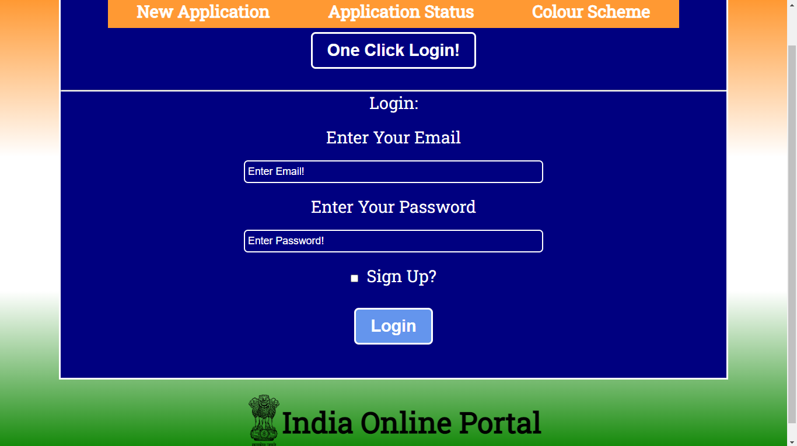
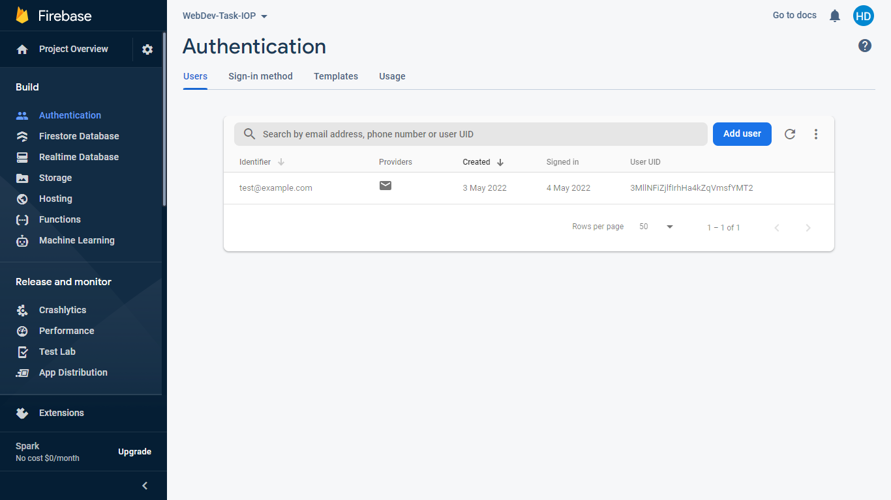
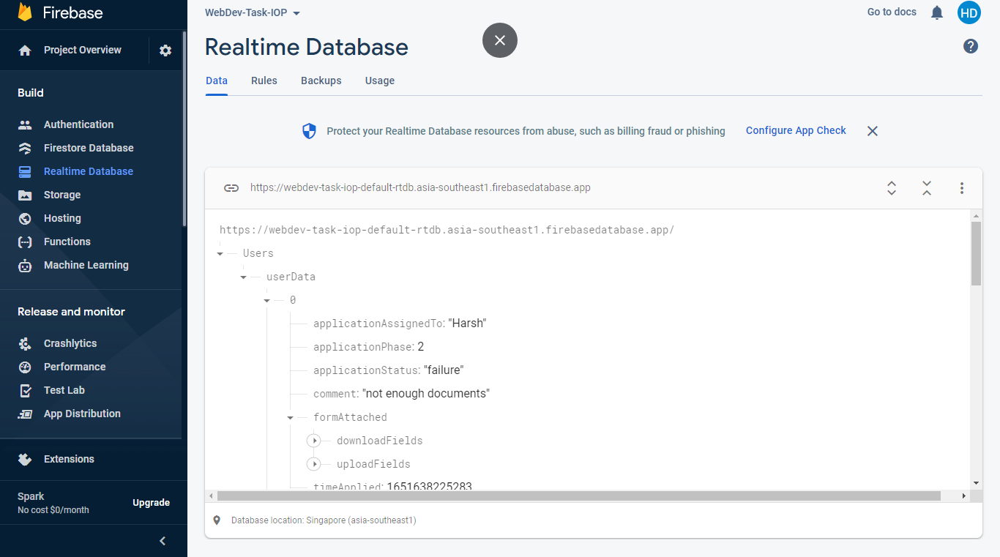
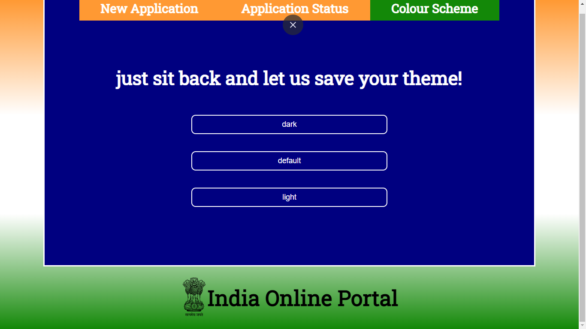
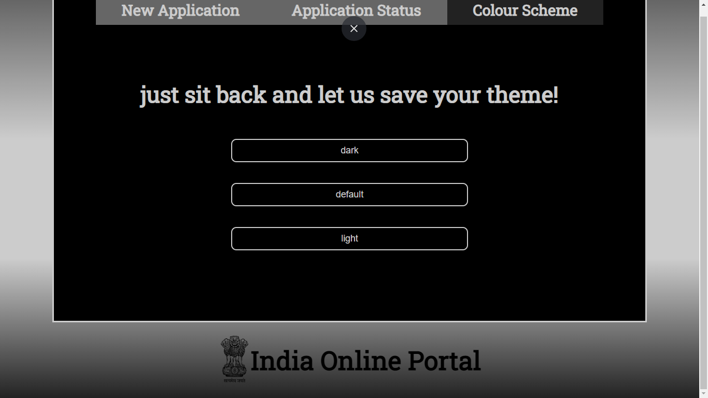
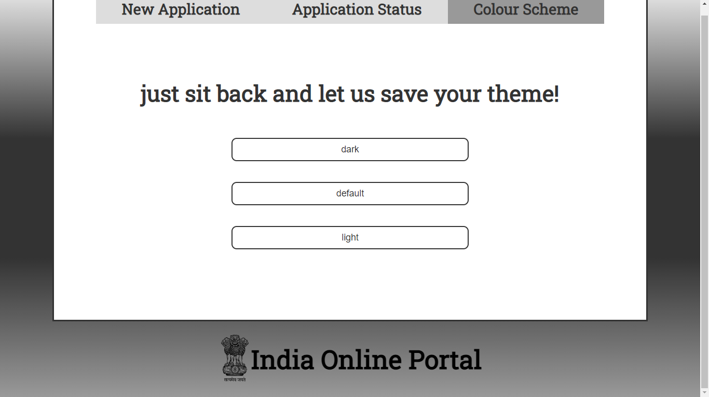

# Web_Dev_Task_BrainSightAI

Hello Brain Sight AI team, this is my project and I know the project was more about basic front-end, but I added some more:
I have poured my heart into it and I know the colours might not be so appealing, but I hope you like it <3

#login and authorization functionality, routes activate only after logging in:

 

 

#back-end connectivity with firebase console, json communication of application data but no file transfer:

 

#customizing with themes, Now load with your previously selected theme:

 

 

 

